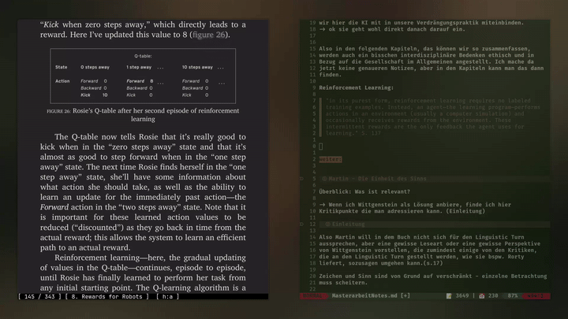

# Plugin Dateien Setup

**DEMO**




## README.md
# nvim-sioyek-highlights

A Neovim plugin to integrate Sioyek PDF reader highlights directly into your editor. 

## Features

- fuzzy-search through your Sioyek highlight-database using Telescope
- Insert highlights as formatted quotes into your current buffer
- Support for both highlight descriptions and annotations

## Requirements

- Neovim >= 0.8
- [Telescope.nvim](https://github.com/nvim-telescope/telescope.nvim)
- `sqlite3` command-line tool
- [Sioyek PDF reader](https://sioyek.info/)

## Installation

### Using [lazy.nvim](https://github.com/folke/lazy.nvim)

```lua
{
  "jbuck95/nvim-sioyek-highlights",
  dependencies = { "nvim-telescope/telescope.nvim" },
  config = true,
}
```

### Using [packer.nvim](https://github.com/wbthomason/packer.nvim)

```lua
use {
  "jbuck95/nvim-sioyek-highlights",
  requires = { "nvim-telescope/telescope.nvim" },
  config = function()
    require("sioyek-highlights").setup()
  end
}
```

## Usage

- `<leader>sh` - Open Sioyek highlights picker
- `:SioyekHighlights` - Command to open the picker

Select a highlight and press Enter to insert it as a formatted quote at your cursor position.

## Configuration

The plugin works out of the box with default Sioyek database location (`~/.local/share/sioyek/shared.db`).

## Requirements

Make sure you have `sqlite3` installed:

**Arch Linux:**
```bash
sudo pacman -S sqlite
```

**Ubuntu/Debian:**
```bash
sudo apt install sqlite3
```

**macOS:**
```bash
brew install sqlite3
```

## Todo

- [ ] proper PDF-Names
- [ ] update formatting/ add format options. 

## License

MIT License
```

## plugin/sioyek-highlights.lua
```lua
-- plugin/sioyek-highlights.lua
if vim.g.loaded_sioyek_highlights == 1 then
  return
end
vim.g.loaded_sioyek_highlights = 1

-- The actual plugin logic is in lua/sioyek-highlights/init.lua
-- This file just ensures the plugin is loaded correctly
```

## lua/sioyek-highlights/init.lua
```lua
-- Dein bestehender Code hier, aber als Modul strukturiert:

local M = {}

-- Alle deine Funktionen hier...
local function get_highlights()
  -- Dein bestehender Code
end

local function insert_highlight()
  -- Dein bestehender Code
end

function M.setup(opts)
  opts = opts or {}
  
  -- Hier könntest du später Konfigurationsoptionen hinzufügen
  
  -- Keymap und Command setup
  vim.keymap.set("n", "<leader>sh", insert_highlight, { desc = "Insert Sioyek Highlight" })
  vim.api.nvim_create_user_command("SioyekHighlights", insert_highlight, {})
end

-- Für Lazy.nvim Kompatibilität
function M.config()
  M.setup()
end

return M
```

## .gitignore
```gitignore
# Vim/Neovim
*.swp
*.swo
*~

# OS
.DS_Store
Thumbs.db

# IDE
.vscode/
.idea/
```

## LICENSE
```
MIT License

Copyright (c) 2025 [Your Name]

Permission is hereby granted, free of charge, to any person obtaining a copy
of this software and associated documentation files (the "Software"), to deal
in the Software without restriction, including without limitation the rights
to use, copy, modify, merge, publish, distribute, sublicense, and/or sell
copies of the Software, and to permit persons to whom the Software is
furnished to do so, subject to the following conditions:

The above copyright notice and this permission notice shall be included in all
copies or substantial portions of the Software.

THE SOFTWARE IS PROVIDED "AS IS", WITHOUT WARRANTY OF ANY KIND, EXPRESS OR
IMPLIED, INCLUDING BUT NOT LIMITED TO THE WARRANTIES OF MERCHANTABILITY,
FITNESS FOR A PARTICULAR PURPOSE AND NONINFRINGEMENT. IN NO EVENT SHALL THE
AUTHORS OR COPYRIGHT HOLDERS BE LIABLE FOR ANY CLAIM, DAMAGES OR OTHER
LIABILITY, WHETHER IN AN ACTION OF CONTRACT, TORT OR OTHERWISE, ARISING FROM,
OUT OF OR IN CONNECTION WITH THE SOFTWARE OR THE USE OR OTHER DEALINGS IN THE
SOFTWARE.
```
